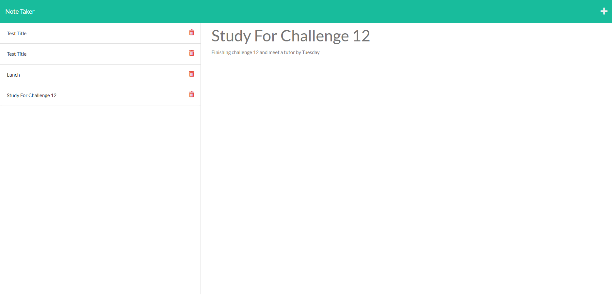

# Note-Taker

## Description
- In this project I am modifying a starter code to create an application called Note Taker that can be used to write and save notes. This application is using Express.js back end and will save and retrieve note date from a JSON file. This application will be also be deployed to Heroku. 

- This project was built because I as a user I want to be able to take notes, save the notes, and delete the notes when I no longer need them. 

- The note app keeps your notes neat and orginized thus it elleviate that problem. 

- In this project I was able to demostrate concepts learned in class such as API and HTML routes, query params, post requests, body parsing, data parsistence, and modular routing. 


## Installation
``
npm nit -y
npm i express
``

## Usage
Once all the packages have been onstalled, run the following commend in the termianl:
```
npm start
```
## User Story

```
AS A small business owner
I WANT to be able to write and save notes
SO THAT I can organize my thoughts and keep track of tasks I need to complete
```


## Acceptance Criteria

```
GIVEN a note-taking application
WHEN I open the Note Taker
THEN I am presented with a landing page with a link to a notes page
WHEN I click on the link to the notes page
THEN I am presented with a page with existing notes listed in the left-hand column, plus empty fields to enter a new note title and the note’s text in the right-hand column
WHEN I enter a new note title and the note’s text
THEN a Save icon appears in the navigation at the top of the page
WHEN I click on the Save icon
THEN the new note I have entered is saved and appears in the left-hand column with the other existing notes
WHEN I click on an existing note in the list in the left-hand column
THEN that note appears in the right-hand column
WHEN I click on the Write icon in the navigation at the top of the page
THEN I am presented with empty fields to enter a new note title and the note’s text in the right-hand column
```

## Link To Deployed Webpage

https://enigmatic-falls-91353.herokuapp.com/notes


## Mock Up


## Credits

- - -
© 2022 Trilogy Education Services, LLC, a 2U, Inc. brand. Confidential and Proprietary. All Rights Reserved.